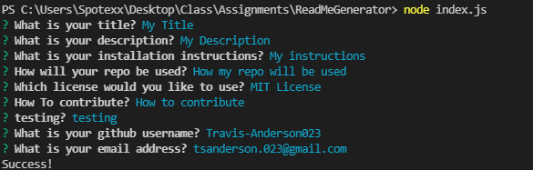

# ReadME Generator
 
## Description

This is a readme generator that operates in terminal. Simply run 'npm i' to install the necessary files then 'node index.js' and fill the answers for the required fields.

## Links

Go to the gif in this repo to see the app working or click [here](https://watch.screencastify.com/v/k7SOEcyDcTcbbm2H6heC) to see the high resolution version of the video.

## Screenshot

